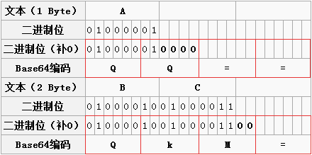
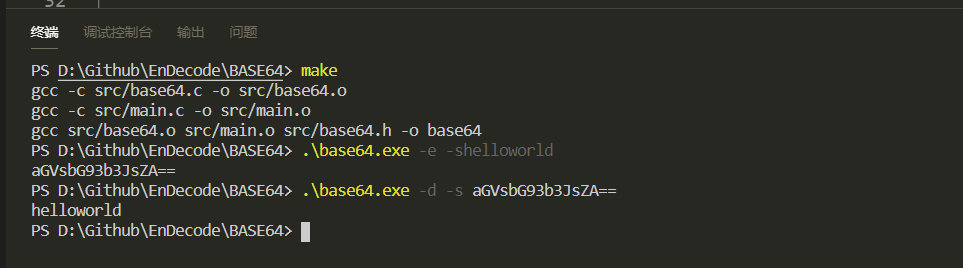

# ``Base64``


## 1. ``Base64``编码由来

​	为什么会有 ``Base64``编码呢？因为有些网络传送渠道并不支持所有的字节，例如传统的邮件只支持可见字符的传送，像ASCII码的控制字符就 不能通过邮件传送。这样用途就受到了很大的限制，比如图片二进制流的每个字节不可能全部是可见字符，所以就传送不了。最好的方法就是在不改变传统协议的情 况下，做一种扩展方案来支持二进制文件的传送。把不可打印的字符也能用可打印字符来表示，问题就解决了。``Base64``编码应运而生，<font color = "red">**`Base64`就是一种 基于64个可打印字符来表示二进制数据的表示方法**。</font>


##  2. ``Base64``索引表

​	``Base64``的索引表，字符选用了"A-Z、a-z、0-9、+、/" 64个可打印字符。数值代表字符的索引，这个是标准`Base64`协议规定的，不能更改。

​	64个字符用6个bit位就可以全部表示，一个字节有8个bit 位，剩下两个bit就浪费掉了，这样就不得不牺牲一部分空间了。这里需要弄明白的就是一个`Base64`字符是8个bit，但是有效部分只有右边的6个 bit，左边两个永远是0。


## 3. ``Base64``原理

<font color = "red">要转换成`Base64`的**最小单位三个字节**，对一个字符串来说每次都是三个字节三个字节的转换，对应的是`Base64`的**最小单位四个字节**。</font>

那么怎么用6个有效bit来表示传统字符的8个bit呢？8和6的最小公倍数 是24，也就是说3个传统字节可以由4个`Base64`字符来表示，保证有效位数是一样的，这样就多了1/3的字节数来弥补`Base64`只有6个有效bit 的不足。

| 原码   | m        | a        | n        |        |
| ------ | -------- | -------- | -------- | ------ |
| ASCII  | 109      | 97       | 110      |        |
| 8 bit  | 01101101 | 01100001 | 01101110 |        |
| 6 bit  | 011011   | 010110   | 000101   | 101110 |
| 十进制 | 27       | 22       | 5        | 46     |
| 编码   | b        | w        | F        | u      |


​	但是转换到最后你发现不够三个字节了怎么办呢？我们可以用两个`Base64`来表示一个字符或用三个`Base64`表示两个字符，像下图的A对应的第二个`Base64`的二进制位只有两个，把后边的四个补0就是了。所以 `A` 对应的`Base64`字符就是 `QQ`，上边已经说过了，原则是`Base64`字符的最小单位是四个字符一组，那这才两个字符，后边补两个"="吧，结果是 `QQ==`其实不用"="也不耽误解码，之所以用"="，可能是考虑到多段编码后的`Base64`字符串拼起来也不会引起混淆。由此可见 `Base64`字符串只可能最后出现一个或两个"="，中间是不可能出现"="的。下图中字符"BC"的编码过程也是一样的。




## 4. 代码

**4.1 代码**

[Base64](https://github.com/augusteight8/EnDeCode/blob/master/Base64): https://github.com/augusteight8/EnDeCode/blob/master/Base64


**4.2 使用**

```bash
make

-e	加密 
-d	解密
-s	输入字符串
```




