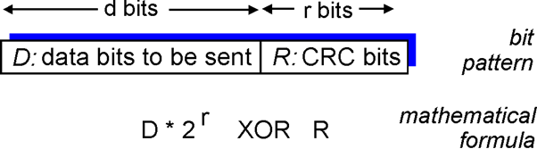

# 计算CRC

+ CRC8
+ CRC16
+ CRC32


## 1、基本概念

#### 1.1、循环冗余检测（Cyclic Redundancy Check，CRC）
CRC编码也被称为多项式编码（polynomial code），因为该编码能够将要发送的比特串看作是系数为 0 和 1 的一个多项式。对比特串操作被解释为多项式算术。


#### 1.2、CRC参数
D：D数据拥有 d 比特
G：发送方和接收方需要协商一个 r+1 比特模式，称为生成多项式（G），**G 的最高有效位比特（最高位）和 最低有效位比特（最低位）必须为 1**
R：发送方选择 r 个附加比特，称为 R（CRC校验码）



（1）**计算**：R 是数据 D 通过**模 2 除法**除 G 运算得到的（姑且这么说）余数，**这个 R 就是 FCS（检测帧序列）**，发送时把 R 附加到数据 D 后面。

（2）**检验**：一共接收有 d+r 个比特，用模 2 算术恰好能够被 G 整除（没有余数），即 （D+R）/ G，如果余数为 0，接收方认为数据正确而被接收，否则接收方知道出现了差错。


#### 1.3、CRC原理解释
所有 CRC 计算采用模 2 算术，即在加法中不进位，在减法中不借位，意味加法和减法是相同的，**等价于操作数的按位异或（XOR）运算**，而不是需要借位运算。

例如：
D = 10110011，d = 8
G = 11001，r = 4
通过计算得到 R = 0100
在这种情况下传输 12 个比特是 101100110100


#### 1.4、例子（一步一步分析）
CRC标准有8、12、16、32比特生成多项式G，一般采用32比特。
举一个例子使用 CRC-8 算法求 **101001110100001** 的 CRC。
CRC-8 标准的 h(x) = x^8^ + x^7^ + x^6^ + x^4^ + x^2^ + 1，既 g 是9位的二进制串111010101。 

1. 首先需要在被除数A后加 8 个比特位0（标准位数减 1）。
2. 进行模2除法运算。注意每次都是模2运算，即异或。
3. 最后得到余数C就是CRC校验值。注意余数位数必须比除数少1位，如果不够前面加0补齐。


**如果数据的比对位为 1，就与 h(x) 进行异或运算然后向后移一位
如果数据的比对位为 0，就直接后移一位**
直到剩余数据长度与标准相等。

经过运算后，最终得到的r是10001100，这就是 CRC 校验码。


#### 1.5、生成多项式


**注意：**
+ **位宽**：文献中提到的生成多项式经常会说到多项式的位宽（Width，简记为W），这个位宽不是多项式对应的二进制数的位数，而是位数减1。比如CRC8中用到的位宽为8的生成多项式，其实对应得二进制数有九位：100110001。**计算出的CRC校验值长度是位宽。**
+ **16进制表示**：多项式表示和二进制表示都很繁琐，交流起来不方便，因此，文献中多用16进制简写法来表示，
+ **省略最高位**：因为生成多项式的最高位肯定为1，最高位的位置由位宽可知，故在简记式中，将最高的1统一去掉了，如CRC32的生成多项式简记为 `0x04C11DB7` 实际上表示的是 `0x104C11DB7`。**这样简记除了方便外，在编程计算时也有它的用处**。


## 2、代码编程原理

<font color=red>**以 CRC32 为例**</font>
<font color=red>**数据都是 8 bit（16进制）**</font>

**声明1**：网上有很多代码，可以看到很多例子不一样（大部分应该没有问题），其实只是他们没有声明自己算法顺序
+ 算法顺序
（1）正向算法：就是一般讲解的多项式，例如 `CRC32 = x32 + x26 + x23 + x22 + x16 + x12 + x11 + x10 + x8 + x7 + x5 + x4 + x2 + x + 1` ，2进制就是 `100000100110000010001110110110111`，16 进制就是 `0x104C11DB7`，但是会去掉最高位，实际使用用 `0x04C11DB7`，这样的话就需要高八位判断，然后左移。
（2）反向算法：反向算法优化的更好，同样 CRC32 是一样的，只是把二进制倒序，2进制就是 `11101101101110001000001100100000`，16 进制就是 `0xedb88320`，这样的话就需要低八位判断，然后右移。

**声明2**：为什么先移位再异或？
+ 原因：因为不论是 CRC 8/16/32，应该是 9/17/33 位，但是二进制只取了 8/16/32 位，即默认省略了最高位的 1，根据规则最高位必须为 1，都统一省略，方便位数声明。（同为 1，异或为 0）

#### 2.1、CRC 校验规则
（1）如果仅使用上面所介绍的规则，这显然不够。
如果在字符串前面加0，并不影响校验值，这就不符合我们的预期了。比如，我们想校验的1字节1001 1100，现在在前面补1字节0，变成2字节0000 0000 1001 1100，结果两个得到的校验值是一样的。所以在实际应用中，CRC校验过程做了一些改变：增加了<font color=red>**“余数初始值”、“结果异或值”、“输入数据反转”、“输出数据反转”**</font>四个概念。

（2）工程中常用CRC校验规则
+ **余数初始值**：即在计算开始前，先给变量CRC赋的初值。
+ **结果异或值**：即在计算结束后，得到的变量CRC与这个值进行异或操作，就得到了最终的校验值。
+ **输入数据反转**：即在计算开始前，将需要校验的数据反转，如数据位1011，反转后为1101。
+ **输出数据反转**：即在计算结束后，与结果异或值异或之前，计算值反转，如计算结果为1011，反转后为1101。


------------------------------------------------------------------------------------------------------------------------------------

------------------------------------------------------------------------------------------------------------------------------------

接下来以 CRC-32 校验为例，讲解工程中使用的 CRC 校验编程实现。具体实现时，以字节为单位进行计算。`const CRC_32 crc_32 = { 0x04c11db7,0xffffffff,0xffffffff,TRUE,TRUE };`
**数据 1 字节 = 8 bit**
1. 预置 1 个 32 位的变量 CRC，存放校验值，首先赋初值 `0xffffffff`；
2. 查看规则判断第一个数据是否需要反转，若需要，则按反转，若不需要，直接进入第3步。这里需要反转；
3. 把第1个数据按照步骤2处理后，与 32 位的变量CRC的高8位相异或，把结果放于变量CRC，低 24 位数据不变；
4. 检查左移后的移出位；
5. 如果移出位为 0，左移一位；如果移出位为 1，变量 CRC 左移一位后与多项式 0x04c11db7 进行异或；
6. 重复步骤4和5，直到左移 8 次（和数据长度一致），这样整个 8 位数据全部进行了处理；
7. 重复步骤2到步骤6，进行通讯信息帧下一个数据（字节）的处理；
8. 将该通讯信息帧所有字节按上述步骤计算完成后，将得到的 32 位变量CRC，查看规则是否需要反转，这里需要反转；
9. 最后，与结果异或值异或，得到的变量 CRC 即为 CRC 校验值；

 这里有两种方法实现，基础都是一样的，分为：**按位计算法**、**查表法**

#### 2.2、按位计算法
**数据虽然是一个一个读取的，但是每次都会移位 8 bit，即下一位刚好在上一位移出时接上下一位，而且异或 8 次，结果还是本身，所以无论是拼接到一起还是 8 bit 计算结果是一样的。**

就是根据规则一遍又一遍的计算得到 CRC 即可。

**分为正向计算和反向计算，正向计算容易理解，反向计算仔细想想，结果是一样的**

```c
#include <stdio.h>
#include <malloc.h>

typedef unsigned char	u8;
typedef unsigned short  u16;
typedef unsigned int    u32;
typedef unsigned long	u64;

//data 是要CRC计算的数据都是 8 bit 的 16 进制
u8 data[] = {
	0x99, 0xaa, 0xbb, 0xcc, 0xdd, 0xee,		//目的 MAC 地址 
	0x54, 0xe1, 0xad, 0x7e, 0xc5, 0x11,		//源 MAC 地址 
	0x08, 0x00,								//帧类型 
	0x45,									//版本号 4，首部长度 20 字节 ==> 5
	0x00,									//服务类型，默认
	0x00, 0x2e,								//总长度（首部 + 数据）
	0x12, 0x34, 							//16 标识位 
	0x40, 0x00,								//3 比特标志不分片 010 ，13 比特片偏移 
	0x40,									//生存时间 64 
	0x11,									//上层协议，以 UDP 为例 17
	0xa4, 0x43,								//IP 首部检验和 
	0xc0, 0xa8, 0x01, 0x51,					//源 IP 地址		192.168.1.81 
	0xc0, 0xa8, 0x01, 0xa6,					//目的地 IP 地址 	192.168.1.166
	0x17, 0xc1,								//源端口 
	0x1b, 0xa9,								//目的地端口 
	0x00, 0x1a,								//UDP 长度 
	0x6c, 0x2c,								//UDP 检验和 
	0x51, 0x51, 0x51, 0x51, 0x51, 0x51,		//传输数据 
	0x51, 0x51, 0x51, 0x51, 0x51, 0x51,
	0x51, 0x51, 0x51, 0x51, 0x51, 0x51
};

//方法一 
u8 reverse8(u8 data) {
    u8 i;
    u8 temp = 0;
    for (i = 0; i < 8; i++)	    				// 8 bit反转
        temp |= ((data >> i) & 0x01) << (7 - i);
    return temp;
}
u32 reverse32(u32 data) {
    u8 i;
    u32 temp = 0;
    for (i = 0; i < 32; i++)					// 32 bit反转
        temp |= ((data >> i) & 0x01) << (31 - i);
    return temp;
}
//正向计算
u32 crc32(u8* addr, int num) {
    u8 data;
    u32 crc = 0xffffffff;						//初始值
    int i;
    for (; num > 0; num--) {
        data = *addr++;
        data = reverse8(data);					//字节反转
        crc = crc ^ (data << 24);				//与crc初始值高8位异或 
        for (i = 0; i < 8; i++) {				//循环8位
            if (crc & 0x80000000)				//左移移出的位为1，左移后与多项式异或
                crc = (crc << 1) ^ 0x04c11db7;
            else {
                crc <<= 1;						//否则直接左移
            }
        }
    }
    crc = reverse32(crc);						//字节反转
    crc = crc ^ 0xffffffff;	                	//最后返与结果异或值异或
    return crc;                                 //返回最终校验值
}

//反向计算
u32 crc32_reverse(u8 array[], int len) {
	u8 data;
	u32 crc = 0xffffffff;
	for (int i = 0; i < len; i++) {
		data = array[i];
		crc = crc ^ data;
		for (int bit = 0; bit < 8; bit++) {				//循环8位
            if (crc & 0x00000001)				//右移移出的位为1，右移后与多项式异或
                crc = (crc >> 1) ^ 0xedb88320;
            else {
                crc >>= 1;						//否则直接右移
            }
        }
	}
	return crc ^ 0xffffffff;
} 

int main() {
	//方法一 
    int data_len = sizeof(data) / sizeof(data[0]);
    u32 crc = crc32(data, data_len);
    printf("crc         检验和为：%x\n", crc);
    u32 crc_reverse = crc32_reverse(data, data_len);
    printf("crc_reverse 检验和为：%x\n", crc_reverse);

    return 0;
}
```

#### 2.3、查表法（如果想弄其他表字节对应修改异或值、是否反转、输入输出前异或值即可）
如果每次像上面这样计算，当数据很长时性能就不好，每个都要从头计算一边，所以就有了查表法，因为都是 8 bit 数据，那么 2^8^ 最多只有 256 种情况，所以先计算出这张表。**（正向表和方向表不一样，所以网上不一样，但是结果一样）**

就是把第二个循环（中间那个循环）单独列出来，计算得到对应表。

```c
#include <stdio.h>
#include <malloc.h>

typedef unsigned char	u8;
typedef unsigned short  u16;
typedef unsigned int    u32;
typedef unsigned long	u64;

//data 是要CRC计算的数据都是 8 bit 的 16 进制
u8 data[] = {
	0x99, 0xaa, 0xbb, 0xcc, 0xdd, 0xee,		//目的 MAC 地址 
	0x54, 0xe1, 0xad, 0x7e, 0xc5, 0x11,		//源 MAC 地址 
	0x08, 0x00,								//帧类型 
	0x45,									//版本号 4，首部长度 20 字节 ==> 5
	0x00,									//服务类型，默认
	0x00, 0x2e,								//总长度（首部 + 数据）
	0x12, 0x34, 							//16 标识位 
	0x40, 0x00,								//3 比特标志不分片 010 ，13 比特片偏移 
	0x40,									//生存时间 64 
	0x11,									//上层协议，以 UDP 为例 17
	0xa4, 0x43,								//IP 首部检验和 
	0xc0, 0xa8, 0x01, 0x51,					//源 IP 地址		192.168.1.81 
	0xc0, 0xa8, 0x01, 0xa6,					//目的地 IP 地址 	192.168.1.166
	0x17, 0xc1,								//源端口 
	0x1b, 0xa9,								//目的地端口 
	0x00, 0x1a,								//UDP 长度 
	0x6c, 0x2c,								//UDP 检验和 
	0x51, 0x51, 0x51, 0x51, 0x51, 0x51,		//传输数据 
	0x51, 0x51, 0x51, 0x51, 0x51, 0x51,
	0x51, 0x51, 0x51, 0x51, 0x51, 0x51
};

//方法二：查表法 
//生成正向计算表
u32 crc32_table[256];
void create_crc32_table() {
	u32 c;
	for (int i = 0; i < 256; i++) {
		c = (u32)i << 24;
		for (int bit = 0; bit < 8; bit++) {
			if (c & 0x80000000) {
				c = (c << 1) ^ 0x04c11db7;		//CRC32正向二进制
			}
			else {
				c = c << 1;
			}
		}
		crc32_table[i] = c;
	}
}
u32 use_crc32_table(u8 array[], int len) {
	u8 data;
	u32 crc = 0xffffffff;						//初始值
	for (int i = 0; i < len; i++) {
		data = reverse8(array[i]);				//是否反转
		u8 n = (crc >> 24) ^ data;
		crc = crc32_table[n] ^ (crc << 8);
	}
	crc = reverse32(crc);						//是否反转
	return crc ^ 0xffffffff;					//输出前异或
}

//生成反向计算表
u32 crc32_table_reverse[256];
void create_crc32_table_reverse() {
	u32 c;
	for (int i = 0; i < 256; i++) {
		c = (u32)i;
		for (int bit = 0; bit < 8; bit++) {
			if (c & 1) {
				c = (c >> 1) ^ (0xedb88320);
			}
			else {
				c = c >> 1;
			}
		}
		crc32_table_reverse[i] = c;
	}
}
u32 use_crc32_table_reverse(u8 array[], int len) {
	u32 crc = 0xffffffff;
	for (int i = 0; i < len; i++) {
		crc = crc32_table_reverse[(crc ^ array[i]) & 0xff] ^ (crc >> 8);
	}
	return crc ^ 0xffffffff;
}

int main() {
	//方法二 
	create_crc32_table();
	u32 crc32 = use_crc32_table(data, data_len);
	printf("crc_table         检验和为：%x\n", crc32);

	create_crc32_table_reverse();
	u32 crc32_reverse = use_crc32_table_reverse(data, data_len);
	printf("crc_table_reverse 检验和为：%x\n", crc32_reverse);
	
//	for (int i = 0; i < 32; i++) {
//		for (int j = 0; j < 8; j++) {
//			printf("0x%08x,", crc32_table[i * 8 + j]);
//		}
//		printf("\n");
//	}
//	printf("\n\n");
//	for (int i = 0; i < 32; i++) {
//		for (int j = 0; j < 8; j++) {
//			printf("0x%08x,", crc32_table_reverse[i * 8 + j]);
//		}
//		printf("\n");
//	}

	return 0;
}
```

#### 2.4、结果及CRC32生成表
**2.4.1、结果**


**2.4.2、正向 CRC32 生成表**


**2.4.3、反向 CRC32 生成表**


## 3、通用正向按位计算代码

记录了常见的 CRC8/16/32 多项式及规则：
`https://crccalc.com/`
`http://www.ip33.com/crc.html`

#### 3.1、各种声明——type.h

```c
#ifndef __TYPE_H__
#define __TYPE_H__
#include <stdio.h>

/*****************************************************************************
*function: 自定义字符长度 
*type	 : 8 bit/ 16 bit/ 32 bit/ 64 bit
******************************************************************************/
typedef unsigned char        u8;
typedef unsigned short       u16;
typedef unsigned int         u32;
typedef unsigned long	     u64;

#define FALSE                0
#define TRUE                 1

#endif
```

#### 3.2、函数接口定义和CRC 参数模型定义——crc.h

```c
#ifndef __CRC_H__
#define __CRC_H__
#include "type.h"

/*****************************************************************************
*function: 定义结构体 
*type	 : 8
******************************************************************************/
typedef struct {
    u8   Poly;          //多项式
    u8   InitValue;     //初始值
    u8   XorOut;        //结果异或值
    bool InputReverse;  //（是否）输入反转
    bool OutputReverse; //（是否）输出反转
} CRC_8;
/*****************************************************************************
*function: 定义结构体 
*type	 : 16
******************************************************************************/
typedef struct {
    u16  Poly;          //多项式
    u16  InitValue;     //初始值
    u16  XorOut;        //结果异或值
    bool InputReverse;  //（是否）输入反转
    bool OutputReverse; //（是否）输出反转
} CRC_16;
/*****************************************************************************
*function: 定义各种类型的结构体 
*type	 : 32
******************************************************************************/
typedef struct {
    u32  Poly;          //多项式
    u32  InitValue;     //初始值
    u32  XorOut;        //结果异或值
    bool InputReverse;  //（是否）输入反转
    bool OutputReverse; //（是否）输出反转
} CRC_32;

/*****************************************************************************
*function: 常见 CRC 参数模型（16进制） 
*first	 : 多项式 
*second  : 初始值 
*third   : 结果异或值 
*fourth  : 输入反转 
*fifth   : 输出反转 
******************************************************************************/
const CRC_8 crc_8          = {0x07, 0x00, 0x00, FALSE, FALSE};
const CRC_8 crc_8_CDMA2000 = {0x9B, 0xff, 0x00, FALSE, FALSE};
const CRC_8 crc_8_DARC     = {0x39, 0x00, 0x00, TRUE, TRUE};
const CRC_8 crc_8_DVB_S2   = {0xD5, 0x00, 0x00, FALSE, FALSE};
const CRC_8 crc_8_EBU      = {0x1D, 0xff, 0x00, FALSE, FALSE};
const CRC_8 crc_8_ITU      = {0x07, 0x00, 0x55, FALSE, FALSE};
const CRC_8 crc_8_I_CODE   = {0x1D, 0xFD, 0x00, FALSE, FALSE};
const CRC_8 crc_8_MAXIM    = {0x31, 0x00, 0x00, TRUE, TRUE};
const CRC_8 crc_8_ROHC     = {0x07, 0xff, 0x00, TRUE, TRUE};
const CRC_8 crc_8_WCDMA    = {0x9B, 0x00, 0x00, TRUE, TRUE};

const CRC_16 crc_16_A           = {0x1021, 0xC6C6, 0x0000, TRUE, TRUE};
const CRC_16 crc_16_ARC         = {0x8005, 0x0000, 0x0000, TRUE, TRUE};
const CRC_16 crc_16_AUG_CCITT   = {0x1021, 0x1D0F, 0x0000, FALSE, FALSE};
const CRC_16 crc_16_BUYPASS     = {0x8005, 0x0000, 0x0000, FALSE, FALSE};
const CRC_16 crc_16_CCITT       = {0x1021, 0x0000, 0x0000, TRUE, TRUE};
const CRC_16 crc_16_CCITT_FALSE = {0x1021, 0xffff, 0x0000, FALSE, FALSE};
const CRC_16 crc_16_CDMA2000    = {0xC867, 0xFFFF, 0x0000, FALSE, FALSE};
const CRC_16 crc_16_DDS110      = {0xC867, 0xFFFF, 0x0000, FALSE, FALSE};
const CRC_16 crc_16_DECT_R      = {0x0589, 0x0000, 0x0001, FALSE, FALSE};
const CRC_16 crc_16_DECT_X      = {0x0589, 0x0000, 0x0000, FALSE, FALSE};
const CRC_16 crc_16_DNP         = {0x3d65, 0x0000, 0xffff, TRUE, TRUE};
const CRC_16 crc_16_EN13757     = {0x3D65, 0x0000, 0xFFFF, FALSE, FALSE};
const CRC_16 crc_16_GENIBUS     = {0x1021, 0xFFFF, 0xFFFF, FALSE, FALSE};
const CRC_16 crc_16_IBM         = {0x8005, 0x0000, 0x0000, TRUE, TRUE};
const CRC_16 crc_16_KERMIT      = {0x1021, 0x0000, 0x0000, TRUE, TRUE};
const CRC_16 crc_16_MAXIM       = {0x8005, 0x0000, 0xffff, TRUE, TRUE};
const CRC_16 crc_16_MCRF4XX     = {0x1021, 0xFFFF, 0x0000, TRUE, TRUE};
const CRC_16 crc_16_MODBUS      = {0x8005, 0xffff, 0x0000, TRUE, TRUE};
const CRC_16 crc_16_RIELLO      = {0x1021, 0xB2AA, 0x0000, TRUE, TRUE};
const CRC_16 crc_16_T10_DIF     = {0x8BB7, 0x0000, 0x0000, FALSE, FALSE};
const CRC_16 crc_16_TELEDISK    = {0xA097, 0x0000, 0x0000, FALSE, FALSE};
const CRC_16 crc_16_TMS37157    = {0x1021, 0x89EC, 0x0000, TRUE, TRUE};
const CRC_16 crc_16_USB         = {0x8005, 0xffff, 0xffff, TRUE, TRUE};
const CRC_16 crc_16_X5          = {0x1021, 0xffff, 0xffff, TRUE, TRUE};
const CRC_16 crc_16_XMODEM      = {0x1021, 0x0000, 0x0000, FALSE, FALSE};

const CRC_32 crc_32        = {0x04c11db7, 0xffffffff, 0xffffffff, TRUE, TRUE};
const CRC_32 crc_32_BZIP2  = {0x04C11DB7, 0xFFFFFFFF, 0xFFFFFFFF, FALSE, FALSE};
const CRC_32 crc_32_C      = {0x1EDC6F41, 0xFFFFFFFF, 0xFFFFFFFF, TRUE, TRUE};
const CRC_32 crc_32_D      = {0xA833982B, 0xFFFFFFFF, 0xFFFFFFFF, TRUE, TRUE};
const CRC_32 crc_32_JAMCRC = {0x04C11DB7, 0xFFFFFFFF, 0x00000000, TRUE, TRUE};
const CRC_32 crc_32_MPEG2  = {0x04c11db7, 0xffffffff, 0x00000000, FALSE, FALSE};
const CRC_32 crc_32_POSIX  = {0x04C11DB7, 0x00000000, 0xFFFFFFFF, FALSE, FALSE};
const CRC_32 crc_32_Q      = {0x814141AB, 0x00000000, 0x00000000, FALSE, FALSE};
const CRC_32 crc_32_XFER   = {0x000000AF, 0x00000000, 0x00000000, FALSE, FALSE};

/*****************************************************************************
*function: CRC 函数声明
*type	 : crc8/crc16/crc32 
******************************************************************************/
u8  crc8(u8* addr, int num, CRC_8 type);
u16 crc16(u8* addr, int num, CRC_16 type);
u32 crc32(u8* addr, int num, CRC_32 type);

/*****************************************************************************
*function: 反转函数声明
*type	 : reverse8/reverse16/reverse32 
******************************************************************************/
u8  reverse8(u8 data);
u16 reverse16(u16 data);
u32 reverse32(u32 data);

#endif
```

#### 3.3、函数实现——crc.cpp

```c
#include "crc.h"
#include "type.h"
#include <stdio.h>

/*****************************************************************************
* @brief : 8 bit反转，如1100 0101 反转后为1010 0011
* @param : 
*   data : 8 bit
* @return: 
*   temp : 反转后的 8 bit
*****************************************************************************/
u8 reverse8(u8 data) {
    u8 i;
    u8 temp = 0;
    // 字节反转
    for (i = 0; i < 8; i++) {
        temp |= ((data >> i) & 0x01) << (7 - i);
    }
    return temp;
}
/*****************************************************************************
* @brief : 16 bit反转，如1100 0101 1110 0101反转后为1010 0111 1010 0011
* @param : 
*   data : 16 bit
* @return: 
*   temp : 反转后的 16 bit
******************************************************************************/
u16 reverse16(u16 data) {
    u8  i;
    u16 temp = 0;
    for (i = 0; i < 16; i++) {
        temp |= ((data >> i) & 0x0001) << (15 - i);
    }
    return temp;
}
/*****************************************************************************
* @brief : 32 bit 反转
* @param : 
*   data : 32 bit
* @return: 
*   temp : 反转后的 16 bit
******************************************************************************/
u32 reverse32(u32 data) {
    u8  i;
    u32 temp = 0;
    for (i = 0; i < 32; i++) {
        temp |= ((data >> i) & 0x01) << (31 - i);
    }
    return temp;
}

/*****************************************************************************
* @brief : CRC 校验，校验值为 8 位
* @param : 
*   addr : 数据首地址
*   num  : 数据长度（字节）
*   type : CRC8 的算法类型
* @return: 
*   crc  : 8 位校验值
******************************************************************************/
u8 crc8(u8* addr, int num, CRC_8 type) {
    u8  data;
    u8  crc = type.InitValue; //初始值
    int i;
    for (; num > 0; num--) {
        data = *addr++;
        if (type.InputReverse == TRUE) {
            data = reverse8(data);
        }
        //与crc初始值异或
        crc = crc ^ data;
        for (i = 0; i < 8; i++) {
            //左移移出的位为1，左移后与多项式异或
            if (crc & 0x80) {
                crc = (crc << 1) ^ type.Poly;
            } else {
                crc <<= 1;
            }
        }
    }
    //满足条件，反转
    if (type.OutputReverse == TRUE) {
        crc = reverse8(crc);
    }
    crc = crc ^ type.XorOut; //最后返与结果异或值异或
    return (crc);            //返回最终校验值
}

/*****************************************************************************
* @brief : CRC 校验，校验值为 16 位
* @param : 
*   addr : 数据首地址
*   num  : 数据长度（字节）
*   type : CRC16 的算法类型
* @return: 
*   crc  : 16 位校验值
******************************************************************************/
u16 crc16(u8* addr, int num, CRC_16 type) {
    u8  data;
    u16 crc = type.InitValue; //初始值
    int i;
    for (; num > 0; num--) {
        data = *addr++;
        if (type.InputReverse == TRUE) {
            data = reverse8(data);
        }
        //与crc初始值高8位异或
        crc = crc ^ (data << 8);
        for (i = 0; i < 8; i++) {
            //左移移出的位为1，左移后与多项式异或
            if (crc & 0x8000) {
                crc = (crc << 1) ^ type.Poly;
            } else {
                crc <<= 1;
            }
        }
    }
    //满足条件，反转
    if (type.OutputReverse == TRUE) {
        crc = reverse16(crc);
    }
    crc = crc ^ type.XorOut; //最后返与结果异或值异或
    return (crc);            //返回最终校验值
}
/*****************************************************************************
* @brief : CRC 校验，校验值为 32 位
* @param : 
*   addr : 数据首地址
*   num  : 数据长度（字节）
*   type : CRC32 的算法类型
* @return: 
*   crc  : 32 位校验值
******************************************************************************/
u32 crc32(u8* addr, int num, CRC_32 type) {
    u8  data;
    u32 crc = type.InitValue; //初始值
    int i;
    for (; num > 0; num--) {
        data = *addr++;
        if (type.InputReverse == TRUE) {
            data = reverse8(data);
        }
        // 与crc初始值高8位异或
        crc = crc ^ (data << 24);
        for (i = 0; i < 8; i++) {
            // 左移移出的位为1，左移后与多项式异或
            if (crc & 0x80000000) {
                crc = (crc << 1) ^ type.Poly;
            } else {
                crc <<= 1;
            }
        }
    }
    //满足条件，反转
    if (type.OutputReverse == TRUE) {
        crc = reverse32(crc);
    }
    crc = crc ^ type.XorOut; //最后返与结果异或值异或
    return (crc);            //返回最终校验值
}
```

#### 3.4、主函数调用——main.cpp

```c
#include <stdio.h>
#include <malloc.h>
#include "type.h"
#include "CRC.h"

/*****************************************************************************
*explain: 8 bit数据 
******************************************************************************/
//data 是要CRC计算的数据都是 8 bit 的 16 进制
u8 data[] = {
	0x99, 0xaa, 0xbb, 0xcc, 0xdd, 0xee,		//目的 MAC 地址 
	0x54, 0xe1, 0xad, 0x7e, 0xc5, 0x11,		//源 MAC 地址 
	0x08, 0x00,								//帧类型 
	0x45,									//版本号 4，首部长度 20 字节 ==> 5
	0x00,									//服务类型，默认
	0x00, 0x2e,								//总长度（首部 + 数据）
	0x12, 0x34, 							//16 标识位 
	0x40, 0x00,								//3 比特标志不分片 010 ，13 比特片偏移 
	0x40,									//生存时间 64 
	0x11,									//上层协议，以 UDP 为例 17
	0xa4, 0x43,								//IP 首部检验和 
	0xc0, 0xa8, 0x01, 0x51,					//源 IP 地址		192.168.1.81 
	0xc0, 0xa8, 0x01, 0xa6,					//目的地 IP 地址 	192.168.1.166
	0x17, 0xc1,								//源端口 
	0x1b, 0xa9,								//目的地端口 
	0x00, 0x1a,								//UDP 长度 
	0x6c, 0x2c,								//UDP 检验和 
	0x51, 0x51, 0x51, 0x51, 0x51, 0x51,		//传输数据 
	0x51, 0x51, 0x51, 0x51, 0x51, 0x51,
	0x51, 0x51, 0x51, 0x51, 0x51, 0x51
};

int main() {
	int len = sizeof(data) / sizeof(data[0]);
	u32 crc = crc32(data, len, crc_32);
	printf("%x\n", crc);
	return 0;
}
```


## 4、参考
**1、循环冗余检验 (CRC) 算法原理**
https://www.cnblogs.com/esestt/archive/2007/08/09/848856.html

**2、CRC校验详解（附代码示例）**
https://blog.csdn.net/u013073067/article/details/86621770

**3、全部代码**
[计算CRC](https://github.com/augusteight8/EnDeCode/tree/master/CRC)


## 5、总结
**5.1、数据**
这是 UDP 64 字节计算CRC，剔除掉前导码。

```python
99 aa bb cc dd ee 54 e1 ad 7e c5 11 08 00 45 00 00 2e 12 34 40 00 40 11 a4 43 c0 a8 01 51 c0 a8 01 a6 17 c1 1b a9 00 1a 6c 2c 51 51 51 51 51 51 51 51 51 51 51 51 51 51 51 51 51 51
```
