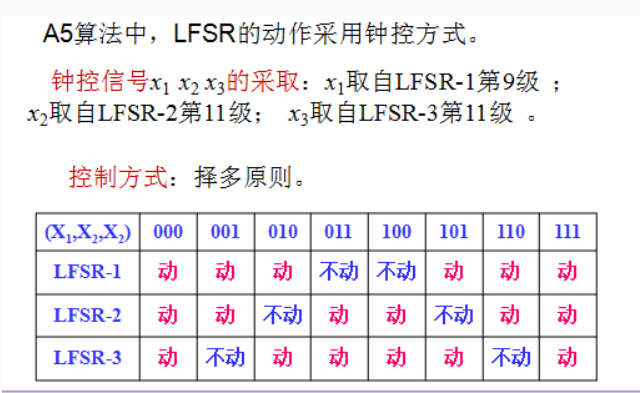

# A5-1

## 1. 简介

- 蜂窝式移动电话系统(GSM)**语音和数字加密**，主要用于手机到基站之间的加密通信。
- 基于三个 `LFSR` 实现，每次通话时，基站产生 `64bit` 随机数，在手机 `sim` 卡产生通信过程主密钥。

## 2. 原理[^1]

### 2.1. 反馈方程

`A5/1` 基于具有不规则钟控的三个线性反馈移位寄存器 （LFSR）的组合。最低有效位的索引为0。 三个移位寄存器的指定如下：

| 寄存器编号 | 寄存器位数 |            反馈方程             | 钟控位 |      抽头      |
| :--------: | :--------: | :-----------------------------: | :----: | :------------: |
|     1      |     19     | $x^{19}+x^{18}+x^{17}+x^{14}+1$ |   8    | 13, 16, 17, 18 |
|     2      |     22     |        $x^{22}+x^{21}+1$        |   10   |     20, 21     |
|     3      |     23     | $x^{23}+x^{22}+x^{21}+x^{8}+1$  |   10   | 7, 20, 21, 22  |

### 2.2. 流程

`A5` 算法的输入为 `22bit` 长的帧序号 `Fn` 和 `64bit` 长的密钥 `Kc`，输出为 `228bit` 的流密钥序列。

#### 2.2.1. 初始化

首先将 3 个 LFSR 的初始状态全设为 0。

然后在 `64bit` 密钥 `Kc` 的作用下，3 个 `LFSR` 分别移位 64 次。每次（假设第 i 次）移位时，反馈函数计算的结果需要先与 `Kc` 的第 i 位进行异或，然后才作为反馈结果填充到每个 `LFSR` 的最末端。

之后在 `22bit` 帧序号 `Fn` 的作用下，3 个 `LFSR` 分别移位 22 次。每次（假设第 i 次）移位时，反馈函数计算的结果需要先与 `Fn` 的第 i 位进行异或，然后才作为反馈结果填充到每个 `LFSR` 的最末端。

初始化阶段的目的是给三个 `LFSR` 提供随机性良好的非全零的初始状态，为后面产生流密钥做准备。

#### 2.2.2. 移位[^2]

钟控会使用择多原则来决定是否对寄存器作移位操作。每个寄存器都有一个相关的钟控位。在每个周期，检查三个寄存器的钟控位，并确定多数位（0或者1）。如果钟控位与多数位一致，则对寄存器作移位操作。

$$
R[0] = R[0] \oplus K[i]
$$

#### 2.2.3. 流密码

整个系统使用前述的钟控机制循环 `100` 个周期，并丢弃输出。完成此操作后，密码已准备好生成输出密钥流的 `228` 位序列，下行（从基地台接收到的讯号）使用前 `114` 位，上行（回传给基地台的讯号）使用后 `114` 位。

# 参考

[^1]: [A5/1维基百科](https://zh.wikipedia.org/wiki/A5/1)
[^2]: [典型序列密码算法之A5](https://nonevector.github.io/posts/7.html)
