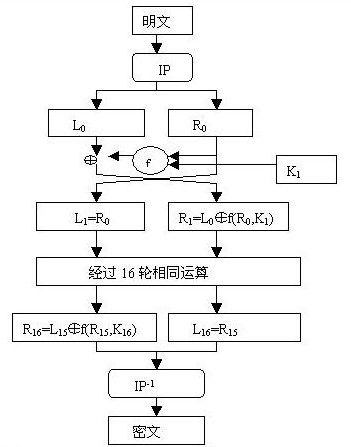
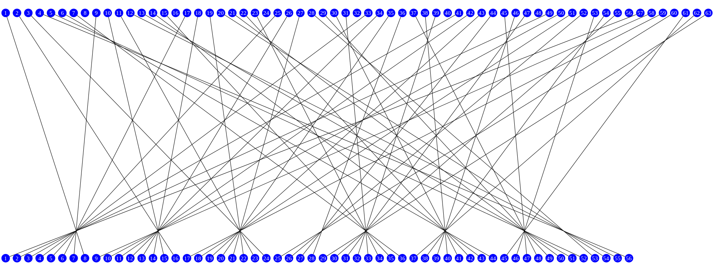
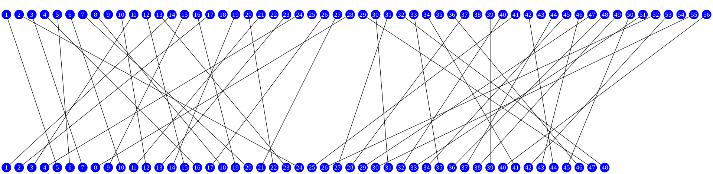
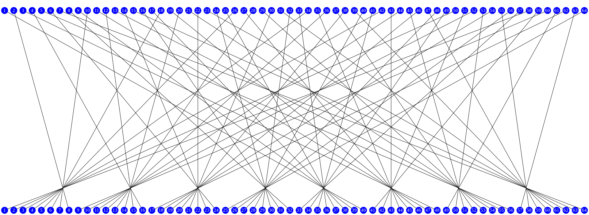
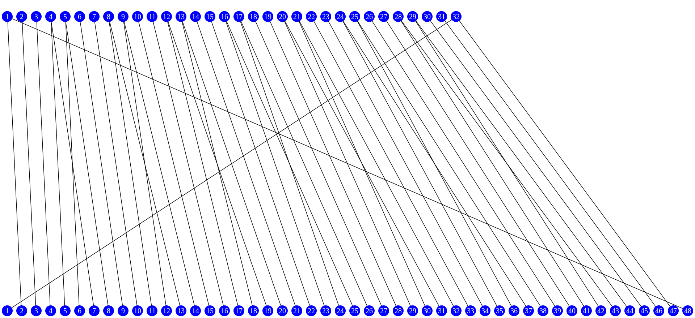
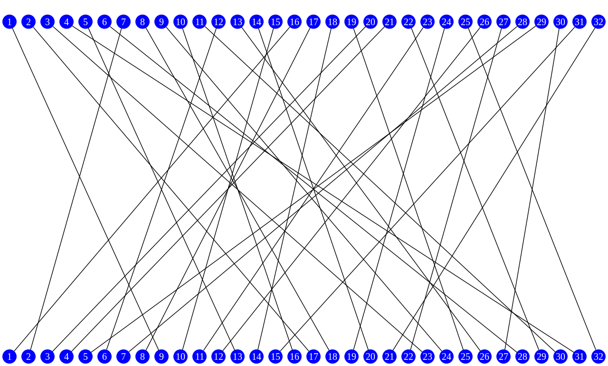
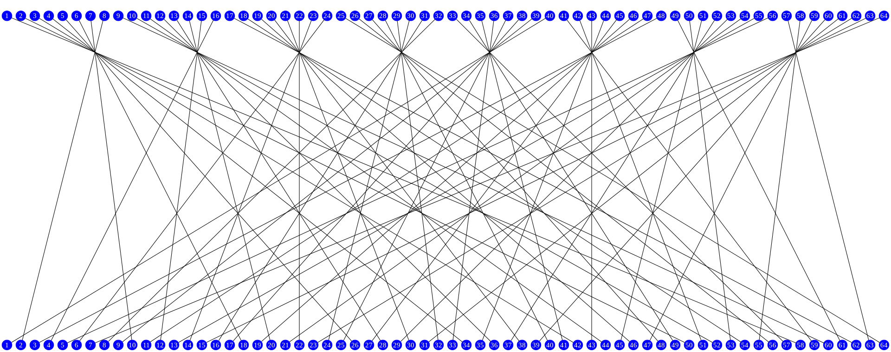

# DES

## 1. 简介

**数据加密标准**（英语：Data Encryption Standard，缩写为 DES）是一种 **对称密钥加密** 算法

DES现在已经不是一种安全的加密方法，主要因为它使用的56位密钥过短。DES标准和3DES标准已逐渐被 **高级加密标准（AES）**所取代

## 2. 原理

DES是一种典型的块密码，一种将固定长度的明文通过一系列复杂的操作变成同样长度的密文的算法。对DES而言，块长度为64位。同时，DES使用密钥来自定义变换过程，因此算法认为只有持有加密所用的密钥的用户才能解密密文。密钥表面上是64位的，然而只有其中的56位被实际用于算法，其余8位可以被用于奇偶校验（第8、16、24、32、40、48、56、64位是校验位，使得每个密钥都有奇数个1），并在算法中被丢弃。因此，DES的有效密钥长度仅为56位。

### 2.1. 模块图片

DES算法的主要流程如下图所示，按照流程依次介绍每个模块。

#### 2.1.1. 整体模块

算法的整体结构如图1所示：有16个相同的处理过程，称为“回次”（*round*），并在首尾各有一次**置换**，称为**IP**与**FP**（或称**IP-1，FP为IP的反函数（即IP“撤销”FP的操作，反之亦然）。IP和FP几乎没有密码学上的重要性，为了在1970年代中期的硬件上简化输入输出数据库的过程而被显式的包括在标准中。**

在主处理回次前，数据块被分成两个32位的半块，并被分别处理；这种交叉的方式被称为**费斯妥结构**。费斯妥结构保证了加密和解密过程足够相似—唯一的区别在于子密钥在解密时是以反向的顺序应用的，而剩余部分均相同。这样的设计大大简化了算法的实现，尤其是硬件实现，因为没有区分加密和解密算法的需要。

图中的 **⊕** 符号代表 **异或（XOR）**操作。“F函数”将数据半块与某个子密钥进行处理。然后，一个F函数的输出与另一个半块异或之后，再与原本的半块组合并交换顺序，进入下一个回次的处理。在最后一个回次完成时，两个半块需要交换顺序，这是费斯妥结构的一个特点，以保证加解密的过程相似。

#### 2.1.2. 密钥调度模块

显示了加密过程中的**密钥调度**—产生子密钥的算法。首先，使用**选择置换1**（PC-1）从64位输入密钥中选出56位的密钥—剩下的8位要么直接丢弃，要么作为**奇偶校验位**。然后，56位分成两个28位的半密钥；每个半密钥接下来都被分别处理。在接下来的回次中，两个半密钥都被左移1或2位（由回次数决定），然后通过**选择置换2**（PC-2）产生48位的子密钥—每个半密钥24位。移位（图中由**<<**标示）表明每个子密钥中使用了不同的位，每个位大致在16个子密钥中的14个出现。

解密过程中，除了子密钥输出的顺序相反外，密钥调度的过程与加密完全相同。

#### 2.1.3. 费斯妥函数（F函数）

其每次对半块（32位）进行操作，并包括四个步骤：

1. **扩张**—用扩张置换（图中的E）将32位的半块扩展到48位，其输出包括8个6位的块，每块包含4位对应的输入位，加上两个邻接的块中紧邻的位。
2. **与密钥混合**—用异或操作将扩张的结果和一个**子密钥**进行混合。16个48位的子密钥—每个用于一个回次的F变换—是利用密钥调度从主密钥生成的（见下文）。
3. **S盒**—在与子密钥混合之后，块被分成8个6位的块，然后使用“S盒”，或称“置换盒”进行处理。8个S盒的每一个都使用以查找表方式提供的非线性的变换将它的6个输入位变成4个输出位。S盒提供了DES的核心安全性—如果没有S盒，密码会是线性的，很容易破解。
4. **置换**—最后，S盒的32个输出位利用固定的置换，“P置换”进行重组。这个设计是为了将每个S盒的4位输出在下一回次的扩张后，使用4个不同的S盒进行处理。

S盒，P置换和E扩张各自满足了克劳德·香农在1940年代提出的实用密码所需的必要条件，“混淆与扩散”。

### 2.2. 步骤

密钥可以先生成，然后开始主模块运算。

#### 2.2.1. 密钥置换

**1、选择置换1(PC-1)**

不考虑每个字节的第8位，DES的密钥由64位减至56位，每个字节的第8位作为奇偶校验位。产生的56位密钥由下表生成（注意表中没有8,16,24,32,40,48,56和64这8位）：

| 左  |     |     |     |     |     |     |
| --- | --- | --- | --- | --- | --- | --- |
| 57  | 49  | 41  | 33  | 25  | 17  | 9   |
| 1   | 58  | 50  | 42  | 34  | 26  | 18  |
| 10  | 2   | 59  | 51  | 43  | 35  | 27  |
| 19  | 11  | 3   | 60  | 52  | 44  | 36  |
| 右  |     |     |     |     |     |     |
| 63  | 55  | 47  | 39  | 31  | 23  | 15  |
| 7   | 62  | 54  | 46  | 38  | 30  | 22  |
| 14  | 6   | 61  | 53  | 45  | 37  | 29  |
| 21  | 13  | 5   | 28  | 20  | 12  | 4   |

**2、密钥调度过程中的循环移位（loopShift）**

　　1. 将56位的密钥分成两部分，每部分28位。
　　2. 根据轮数，这两部分分别循环左移1位或2位。

| 轮数     | 1   | 2   | 3   | 4   | 5   | 6   | 7   | 8   | 9   | 10  | 11  | 12  | 13  | 14  | 15  | 16  |
| -------- | --- | --- | --- | --- | --- | --- | --- | --- | --- | --- | --- | --- | --- | --- | --- | --- |
| 左移位数 | 1   | 1   | 2   | 2   | 2   | 2   | 2   | 2   | 1   | 2   | 2   | 2   | 2   | 2   | 2   | 1   |

**3、选择置换2(PC-2)**

在DES的每一轮中，从56位密钥产生出不同的48位子密钥。这个过程中，既置换了每位的顺序，又选择了子密钥，因此称为压缩置换。压缩置换规则如下表（注意表中没有9，18，22，25，35，38，43和54这8位）：

| 14  | 17  | 11  | 24  | 1   | 5   |
| --- | --- | --- | --- | --- | --- |
| 3   | 28  | 15  | 6   | 21  | 10  |
| 23  | 19  | 12  | 4   | 26  | 8   |
| 16  | 7   | 27  | 20  | 13  | 2   |
| 41  | 52  | 31  | 37  | 47  | 55  |
| 30  | 40  | 51  | 45  | 33  | 48  |
| 44  | 49  | 39  | 56  | 34  | 53  |
| 46  | 42  | 50  | 36  | 29  | 32  |

#### 2.2.2. 初始置换

(IP, Initial permutation)，表中的数字代表新数据中此位置的数据在原数据中的位置，即原数据块的第58位放到新数据的第1位，第50位放到第2位，……依此类推，第7位放到第64位。置换后的数据分为L0和R0两部分，L0为新数据的左32位，R0为新数据的右32位。

| 58  | 50  | 42  | 34  | 26  | 18  | 10  | 2   |
| --- | --- | --- | --- | --- | --- | --- | --- |
| 60  | 52  | 44  | 36  | 28  | 20  | 12  | 4   |
| 62  | 54  | 46  | 38  | 30  | 22  | 14  | 6   |
| 64  | 56  | 48  | 40  | 32  | 24  | 16  | 8   |
| 57  | 49  | 41  | 33  | 25  | 17  | 9   | 1   |
| 59  | 51  | 43  | 35  | 27  | 19  | 11  | 3   |
| 61  | 53  | 45  | 37  | 29  | 21  | 13  | 5   |
| 63  | 55  | 47  | 39  | 31  | 23  | 15  | 7   |

#### 2.2.3. F 模块函数

**1、扩张函数 (E函数)**

扩张函数被作为最初和最终的置换。注意输入中的某些位在输出中被用到了不止一次，例如输入的第5位出现在输出的第6和8位。因此，32位的半块输入被**扩张**到了48位。

| 32  | 1   | 2   | 3   | 4   | 5   |
| --- | --- | --- | --- | --- | --- |
| 4   | 5   | 6   | 7   | 8   | 9   |
| 8   | 9   | 10  | 11  | 12  | 13  |
| 12  | 13  | 14  | 15  | 16  | 17  |
| 16  | 17  | 18  | 19  | 20  | 21  |
| 20  | 21  | 22  | 23  | 24  | 25  |
| 24  | 25  | 26  | 27  | 28  | 29  |
| 28  | 29  | 30  | 31  | 32  | 1   |

**2、置换盒 (S盒)**

扩展置换之后，右半部分数据R0变为48位，与密钥置换得到的轮密钥进行异或。得到48位的数据，将这个数据送人S盒，进行替代运算。替代由8个不同的S盒完成，每个S盒有6位输入4位输出。48位输入分为8个6位的分组，一个分组对应一个S盒，对应的S盒对各组进行代替操作。

列出了DES中使用的8个S盒。每个S盒将6位输入变为4位输出。给定输入后，输出行由外侧 2 位确定，列由内侧的 4 位确定，例如“**0**1101**1**”的输入的外侧位为“**01**”，内侧位为“1101”，而每张表的第一行为“00”，第一列为“0000”因此在S5中的对应输出为“1001”（十进制的9），即第2行，第14列。

|   S1   |        |        |        |        |        |        |        |        |        |        |        |        |        |        |        |        |
| :----: | :----: | :----: | :----: | :----: | :----: | :----: | :----: | :----: | :----: | :----: | :----: | :----: | :----: | :----: | :----: | :----: |
|        | x0000x | x0001x | x0010x | x0011x | x0100x | x0101x | x0110x | x0111x | x1000x | x1001x | x1010x | x1011x | x1100x | x1101x | x1110x | x1111x |
| 0yyyy0 |   14   |   4    |   13   |   1    |   2    |   15   |   11   |   8    |   3    |   10   |   6    |   12   |   5    |   9    |   0    |   7    |
| 0yyyy1 |   0    |   15   |   7    |   4    |   14   |   2    |   13   |   1    |   10   |   6    |   12   |   11   |   9    |   5    |   3    |   8    |
| 1yyyy0 |   4    |   1    |   14   |   8    |   13   |   6    |   2    |   11   |   15   |   12   |   9    |   7    |   3    |   10   |   5    |   0    |
| 1yyyy1 |   15   |   12   |   8    |   2    |   4    |   9    |   1    |   7    |   5    |   11   |   3    |   14   |   10   |   0    |   6    |   13   |

|   S2   |        |        |        |        |        |        |        |        |        |        |        |        |        |        |        |        |
| :----: | :----: | :----: | :----: | :----: | :----: | :----: | :----: | :----: | :----: | :----: | :----: | :----: | :----: | :----: | :----: | :----: |
|        | x0000x | x0001x | x0010x | x0011x | x0100x | x0101x | x0110x | x0111x | x1000x | x1001x | x1010x | x1011x | x1100x | x1101x | x1110x | x1111x |
| 0yyyy0 |   15   |   1    |   8    |   14   |   6    |   11   |   3    |   4    |   9    |   7    |   2    |   13   |   12   |   0    |   5    |   10   |
| 0yyyy1 |   3    |   13   |   4    |   7    |   15   |   2    |   8    |   14   |   12   |   0    |   1    |   10   |   6    |   9    |   11   |   5    |
| 1yyyy0 |   0    |   14   |   7    |   11   |   10   |   4    |   13   |   1    |   5    |   8    |   12   |   6    |   9    |   3    |   2    |   15   |
| 1yyyy1 |   13   |   8    |   10   |   1    |   3    |   15   |   4    |   2    |   11   |   6    |   7    |   12   |   0    |   5    |   14   |   9    |

|   S3   |        |        |        |        |        |        |        |        |        |        |        |        |        |        |        |        |
| :----: | :----: | :----: | :----: | :----: | :----: | :----: | :----: | :----: | :----: | :----: | :----: | :----: | :----: | :----: | :----: | :----: |
|        | x0000x | x0001x | x0010x | x0011x | x0100x | x0101x | x0110x | x0111x | x1000x | x1001x | x1010x | x1011x | x1100x | x1101x | x1110x | x1111x |
| 0yyyy0 |   10   |   0    |   9    |   14   |   6    |   3    |   15   |   5    |   1    |   13   |   12   |   7    |   11   |   4    |   2    |   8    |
| 0yyyy1 |   13   |   7    |   0    |   9    |   3    |   4    |   6    |   10   |   2    |   8    |   5    |   14   |   12   |   11   |   15   |   1    |
| 1yyyy0 |   13   |   6    |   4    |   9    |   8    |   15   |   3    |   0    |   11   |   1    |   2    |   12   |   5    |   10   |   14   |   7    |
| 1yyyy1 |   1    |   10   |   13   |   0    |   6    |   9    |   8    |   7    |   4    |   15   |   14   |   3    |   11   |   5    |   2    |   12   |

|   S4   |        |        |        |        |        |        |        |        |        |        |        |        |        |        |        |        |
| :----: | :----: | :----: | :----: | :----: | :----: | :----: | :----: | :----: | :----: | :----: | :----: | :----: | :----: | :----: | :----: | :----: |
|        | x0000x | x0001x | x0010x | x0011x | x0100x | x0101x | x0110x | x0111x | x1000x | x1001x | x1010x | x1011x | x1100x | x1101x | x1110x | x1111x |
| 0yyyy0 |   7    |   13   |   14   |   3    |   0    |   6    |   9    |   10   |   1    |   2    |   8    |   5    |   11   |   12   |   4    |   15   |
| 0yyyy1 |   13   |   8    |   11   |   5    |   6    |   15   |   0    |   3    |   4    |   7    |   2    |   12   |   1    |   10   |   14   |   9    |
| 1yyyy0 |   10   |   6    |   9    |   0    |   12   |   11   |   7    |   13   |   15   |   1    |   3    |   14   |   5    |   2    |   8    |   4    |
| 1yyyy1 |   3    |   15   |   0    |   6    |   10   |   1    |   13   |   8    |   9    |   4    |   5    |   11   |   12   |   7    |   2    |   14   |

|   S5   |        |        |        |        |        |        |        |        |        |        |        |        |        |        |        |        |
| :----: | :----: | :----: | :----: | :----: | :----: | :----: | :----: | :----: | :----: | :----: | :----: | :----: | :----: | :----: | :----: | :----: |
|        | x0000x | x0001x | x0010x | x0011x | x0100x | x0101x | x0110x | x0111x | x1000x | x1001x | x1010x | x1011x | x1100x | x1101x | x1110x | x1111x |
| 0yyyy0 |   2    |   12   |   4    |   1    |   7    |   10   |   11   |   6    |   8    |   5    |   3    |   15   |   13   |   0    |   14   |   9    |
| 0yyyy1 |   14   |   11   |   2    |   12   |   4    |   7    |   13   |   1    |   5    |   0    |   15   |   10   |   3    |   9    |   8    |   6    |
| 1yyyy0 |   4    |   2    |   1    |   11   |   10   |   13   |   7    |   8    |   15   |   9    |   12   |   5    |   6    |   3    |   0    |   14   |
| 1yyyy1 |   11   |   8    |   12   |   7    |   1    |   14   |   2    |   13   |   6    |   15   |   0    |   9    |   10   |   4    |   5    |   3    |

|   S6   |        |        |        |        |        |        |        |        |        |        |        |        |        |        |        |        |
| :----: | :----: | :----: | :----: | :----: | :----: | :----: | :----: | :----: | :----: | :----: | :----: | :----: | :----: | :----: | :----: | :----: |
|        | x0000x | x0001x | x0010x | x0011x | x0100x | x0101x | x0110x | x0111x | x1000x | x1001x | x1010x | x1011x | x1100x | x1101x | x1110x | x1111x |
| 0yyyy0 |   12   |   1    |   10   |   15   |   9    |   2    |   6    |   8    |   0    |   13   |   3    |   4    |   14   |   7    |   5    |   11   |
| 0yyyy1 |   10   |   15   |   4    |   2    |   7    |   12   |   9    |   5    |   6    |   1    |   13   |   14   |   0    |   11   |   3    |   8    |
| 1yyyy0 |   9    |   14   |   15   |   5    |   2    |   8    |   12   |   3    |   7    |   0    |   4    |   10   |   1    |   13   |   11   |   6    |
| 1yyyy1 |   4    |   3    |   2    |   12   |   9    |   5    |   15   |   10   |   11   |   14   |   1    |   7    |   6    |   0    |   8    |   13   |

|   S7   |        |        |        |        |        |        |        |        |        |        |        |        |        |        |        |        |
| :----: | :----: | :----: | :----: | :----: | :----: | :----: | :----: | :----: | :----: | :----: | :----: | :----: | :----: | :----: | :----: | :----: |
|        | x0000x | x0001x | x0010x | x0011x | x0100x | x0101x | x0110x | x0111x | x1000x | x1001x | x1010x | x1011x | x1100x | x1101x | x1110x | x1111x |
| 0yyyy0 |   4    |   11   |   2    |   14   |   15   |   0    |   8    |   13   |   3    |   12   |   9    |   7    |   5    |   10   |   6    |   1    |
| 0yyyy1 |   13   |   0    |   11   |   7    |   4    |   9    |   1    |   10   |   14   |   3    |   5    |   12   |   2    |   15   |   8    |   6    |
| 1yyyy0 |   1    |   4    |   11   |   13   |   12   |   3    |   7    |   14   |   10   |   15   |   6    |   8    |   0    |   5    |   9    |   2    |
| 1yyyy1 |   6    |   11   |   13   |   8    |   1    |   4    |   10   |   7    |   9    |   5    |   0    |   15   |   14   |   2    |   3    |   12   |

|   S8   |        |        |        |        |        |        |        |        |        |        |        |        |        |        |        |        |
| :----: | :----: | :----: | :----: | :----: | :----: | :----: | :----: | :----: | :----: | :----: | :----: | :----: | :----: | :----: | :----: | :----: |
|        | x0000x | x0001x | x0010x | x0011x | x0100x | x0101x | x0110x | x0111x | x1000x | x1001x | x1010x | x1011x | x1100x | x1101x | x1110x | x1111x |
| 0yyyy0 |   13   |   2    |   8    |   4    |   6    |   15   |   11   |   1    |   10   |   9    |   3    |   14   |   5    |   0    |   12   |   7    |
| 0yyyy1 |   1    |   15   |   13   |   8    |   10   |   3    |   7    |   4    |   12   |   5    |   6    |   11   |   0    |   14   |   9    |   2    |
| 1yyyy0 |   7    |   11   |   4    |   1    |   9    |   12   |   14   |   2    |   0    |   6    |   10   |   13   |   15   |   3    |   5    |   8    |
| 1yyyy1 |   2    |   1    |   14   |   7    |   4    |   10   |   8    |   13   |   15   |   12   |   9    |   0    |   3    |   5    |   6    |   11   |

**3、P置换**

P置换将32位的半块数据重新排列。

| 16  | 7   | 20  | 21  |
| --- | --- | --- | --- |
| 29  | 12  | 28  | 17  |
| 1   | 15  | 23  | 26  |
| 5   | 18  | 31  | 10  |
| 2   | 8   | 24  | 14  |
| 32  | 27  | 3   | 9   |
| 19  | 13  | 30  | 6   |
| 22  | 11  | 4   | 25  |

#### 2.2.4. 最终置换 (IP-1)

IP-1（亦被称为FP）是IP的逆过程。

| 40  | 8   | 48  | 16  | 56  | 24  | 64  | 32  |
| --- | --- | --- | --- | --- | --- | --- | --- |
| 39  | 7   | 47  | 15  | 55  | 23  | 63  | 31  |
| 38  | 6   | 46  | 14  | 54  | 22  | 62  | 30  |
| 37  | 5   | 45  | 13  | 53  | 21  | 61  | 29  |
| 36  | 4   | 44  | 12  | 52  | 20  | 60  | 28  |
| 35  | 3   | 43  | 11  | 51  | 19  | 59  | 27  |
| 34  | 2   | 42  | 10  | 50  | 18  | 58  | 26  |
| 33  | 1   | 41  | 9   | 49  | 17  | 57  | 25  |

