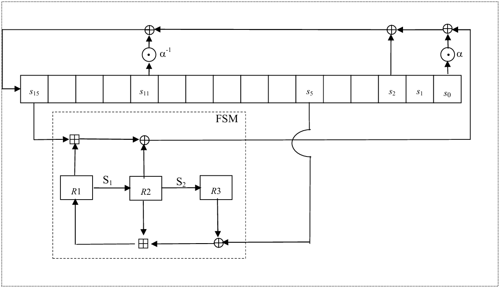
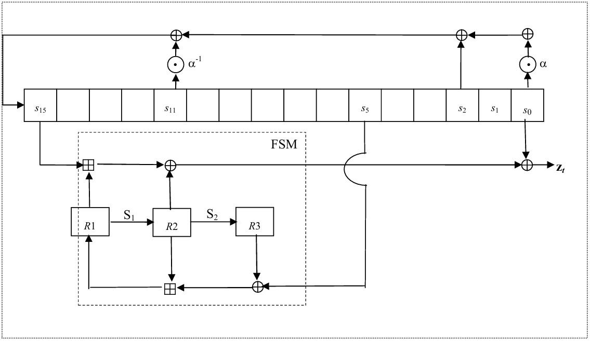

# SNOW_3G

## 1. 简介

- 面向字的流加密算法，由ETSI/SAGE于2006年设计，是**3GPP**的第二套加密和完整性算法的核心。
- 16级移存器+有限状态自动机。

## 2. SNOW原理[^1]

### 2.1. Functions used in different Components of SNOW 3G

#### 2.1.1. MULx

$$
\begin{cases}
    MULx(V,c) &= (V \ll_{8} 1) \oplus c \qquad (V\&0x80) \\
    MULx(V,c) &= (V \ll_{8} 1) \qquad
\end{cases}
$$

#### 2.1.2. MULxPOW

$$
\begin{cases}
    MULxPOW(V,i,c) = V \qquad (i=0) \\
    MULxPOW(V,i,c) = MULx(MULxPOW(V,i-1,c),c) \qquad
\end{cases}
$$

### 2.2. LFSR

### 2.3. FSM

#### 2.3.1. The 32x32-bit S-Box S1

$$
\begin{aligned}
    r_{0} &= MULx(S_{R}(w_{0}),0x1B) &&\oplus S_{R}(w_{1}) &&\oplus S_{R}(w_{2}) &&\oplus MULx(S_{R}(w_{3}),0x1B) \oplus S_{R}(w_{3}) \\
    r_{1} &= MULx(S_{R}(w_{0}),0x1B) \oplus S_{R}(w_{0}) &&\oplus MULx(S_{R}(w_{1}),0x1B) &&\oplus S_{R}(w_{2}) &&\oplus S_{R}(w_{3}) \\
    r_{2} &= S_{R}(w_{0}) &&\oplus MULx(S_{R}(w_{1}),0x1B) \oplus S_{R}(w_{1}) &&\oplus MULx(S_{R}(w_{2}),0x1B) &&\oplus S_{R}(w_{3}) \\
    r_{3} &= S_{R}(w_{0}) &&\oplus S_{R}(w_{1}) &&\oplus MULx(S_{R}(w_{3}),0x1B) \oplus S_{R}(w_{3}) &&\oplus MULx(S_{R}(w_{3}),0x1B)
\end{aligned}
$$

#### 2.3.2. The 32x32-bit S-Box S2 

$$
\begin{aligned}
    r_{0} &= MULx(S_{Q}(w_{0}),0x69) &&\oplus S_{Q}(w_{1}) &&\oplus S_{Q}(w_{2}) &&\oplus MULx(S_{Q}(w_{3}),0x69) \oplus S_{Q}(w_{3}) \\
    r_{1} &= MULx(S_{Q}(w_{0}),0x69) \oplus S_{Q}(w_{0}) &&\oplus MULx(S_{Q}(w_{1}),0x69) &&\oplus S_{Q}(w_{2}) &&\oplus S_{Q}(w_{3}) \\
    r_{2} &= S_{Q}(w_{0}) &&\oplus MULx(S_{Q}(w_{1}),0x69) \oplus S_{Q}(w_{1}) &&\oplus MULx(S_{Q}(w_{2}),0x69) &&\oplus S_{Q}(w_{3}) \\
    r_{3} &= S_{Q}(w_{0}) &&\oplus S_{Q}(w_{1}) &&\oplus MULx(S_{Q}(w_{3}),0x69) \oplus S_{Q}(w_{3}) &&\oplus MULx(S_{Q}(w_{3}),0x69) 
\end{aligned}
$$

### 2.4. The Clocking Operations

#### 2.4.1. MULa

$$
MULa(c) = (MULxPOW(c, 23, 0xA9) || MULxPOW(c, 245, 0xA9) || MULxPOW(c, 48, 0xA9) || MULxPOW(c, 239, 0xA9))
$$

#### 2.4.2. DIVa

$$
DIVa(c) = (MULxPOW(c, 16, 0xA9) || MULxPOW(c, 39, 0xA9) || MULxPOW(c, 6, 0xA9) || MULxPOW(c, 64, 0xA9))
$$

#### 2.4.3. Initialisation Mode

#### 2.4.4. Keystream Mode

#### 2.4.5. Clocking the FSM

$$
\begin{aligned}
    F &= (s_{15} \boxplus R_{1}) \oplus R_{2} \\
    r &= R_{2} \boxplus (R_{3} \oplus s_{5}) \\
    R_{3} &= S_{2}(R_{2}) \\
    R_{2} &= S_{1}(R_{1}) \\
    R_{1} &= r
\end{aligned}
$$

## 3. UEA2/UIA2原理[^2]

# 参考

[^1]: [snow3gspec.pdf](https://www.gsma.com/security/wp-content/uploads/2019/05/snow3gspec.pdf)
[^2]: [uea2uia2d1v21.pdf](https://www.gsma.com/security/wp-content/uploads/2019/05/uea2uia2d1v21.pdf)

