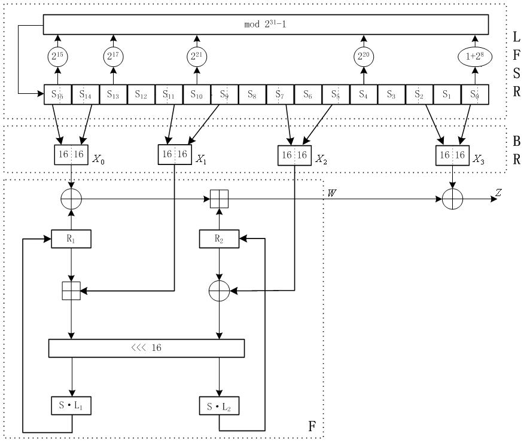

# 祖冲之算法（ZUC）

# 简介

- 祖冲之算法，是移动通信 `3GPP` 机密性算法 `EEA3` 和完整性算法 `EIA3` 的核心，其亦是中国自主设计的加密算法；
- 于 2011 年 9 月正式被 `3GPP SA` 全会通过，成为 `3GPP LTE` 第三套加密标准核心算法，是中国**第一个**成为国际密码标准的密码算法；
- 逻辑上采用三层设计结构，具有高安全性、高效率性和新颖性，不差于 `AES` 和 `SNOW 3G`。

## 1. 原理[^1]

参考一网址包含全部介绍和实现。

### 1.1. 总体结构

`ZUC` 有三个逻辑层。顶层是一个包含 16 个阶段的线性反馈移位寄存器（LFSR），中间层是用于位重组（BR），底层是一个非线性函数 `F`。

# 参考

[^1]: [中国科学院信息工程研究所DCS中心](http://dacas.iie.cas.cn/zucsf/sfjsxwd/)](https://journals.riverpublishers.com/index.php/JCSANDM/article/view/2963/5091)
